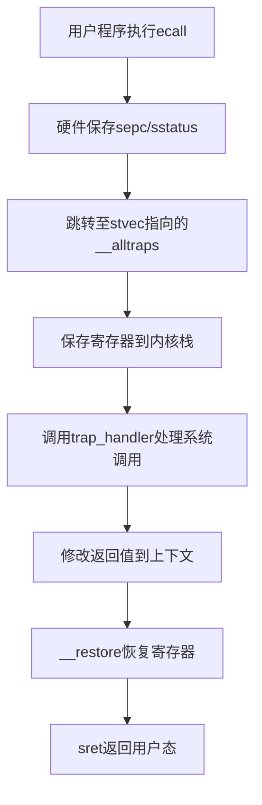

## Rust 所有权模型和借用检查

### **一、所有权模型（Ownership）**
#### 1. **所有权规则**
Rust 通过三个核心规则管理内存：
• **唯一所有者**：每个值有且仅有一个所有者变量；
• **作用域释放**：当所有者离开作用域，值自动被释放；
• **所有权转移**：赋值、传参或返回值时，所有权默认转移（Move），原变量失效。

**示例**：
```rust
let s1 = String::from("hello"); // s1 是字符串的所有者
let s2 = s1;                    // 所有权转移至 s2
// println!("{}", s1);          // 编译错误：s1 已失效
```

#### 2. **所有权与数据类型**
• **复制语义（Copy）**：基本类型（如 `i32`）在赋值时复制值，不转移所有权；
• **移动语义（Move）**：堆分配类型（如 `String`、`Vec`）赋值时转移所有权，原变量失效。

**示例**：
```rust
let x = 5;       // i32 类型（Copy）
let y = x;       // 复制值，x 仍有效
println!("{}, {}", x, y); // 正常输出
```

---
### **二、借用机制（Borrowing）**
#### 1. **借用的类型**
• **不可变借用（&T）**：允许多个只读引用，不能修改数据；
• **可变借用（&mut T）**：唯一可变引用，允许修改数据。

**示例**：
```rust
let mut s = String::from("hello");
let r1 = &s;          // 不可变借用
let r2 = &s;          // 多个不可变借用合法
// let r3 = &mut s;   // 编译错误：不可变与可变借用冲突
```
#### 2. **借用规则**
• **互斥性**：可变借用与不可变借用不能共存；
• **作用域约束**：引用的生命周期不能超过所有者。
#### 3.**实际应用意义​**​
- 避免数据竞争（Data Race）：在多线程环境下，防止同时读写同一内存区域；
- 确保内存一致性：强制代码通过显式约束管理数据访问，消除隐式错误
---
### **三、生命周期（Lifetimes）**
#### 1. **生命周期标注**
显式标注引用的有效范围，确保引用不悬垂：
```rust
fn longest<'a>(x: &'a str, y: &'a str) -> &'a str {
    if x.len() > y.len() { x } else { y }
}
```
#### 2. **生命周期省略规则**
Rust 编译器通过 ​**​三条固定规则​**​ 自动推断函数/方法的引用生命周期，避免开发者手动标注。这些规则 ​**​仅适用于输入和输出为引用类型的情况​**​，且不会改变引用的实际生命周期
1. 每个引用参数分配独立生命周期
	1. **给每个引用参数发一张“身份证”​**
	2. 当函数接收多个引用参数时，编译器会为每个引用参数分配一个独立的生命周期（比如 `'a`、`'b`），就像给每个参数发一张独立的身份证。
2. 单输入生命周期传递到输出
	1.  **唯一输入时“共享身份证”​**
	2. 如果函数 ​**​只有一个输入引用参数​**​，编译器会将该参数的“身份证”直接复制给所有输出引用，相当于强制要求：“返回的引用必须和输入参数活的一样长”。
3. 方法中的self生命周期优先
	1.  **“老大优先”原则​**
	2. 当方法是结构体的成员方法（即参数包含 `&self` 或 `&mut self`）时，编译器会将 `self` 的“身份证”赋予所有输出引用，相当于宣告：“返回的引用必须和结构体实例本身活的一样长”。
---
### **四、借用检查器（Borrow Checker）**
Rust 的​**​借用检查器​**​就像一位严格的图书管理员，时刻盯着你的代码，确保你不会“乱借书”（数据）导致图书馆（内存）混乱。它的核心任务是​**​在编译时发现潜在的内存安全问题​**​，比如悬垂引用、数据竞争等，而不是等到程序运行时崩溃。

---
### **五、所有权与借用的优势**
#### **设计哲学：以约束换取自由​**​
- ​**​安全与性能的平衡​**​：在保证内存安全的前提下，实现与 C/C++ 相媲美的性能
- ​**​现代软件架构的范式​**​：通过编译时检查减少运行时不确定性，适用于区块链、操作系统等对可靠性要求极高的领域
---
### **六、总结**
Rust 的所有权模型和借用检查机制为内存安全提供了强有力的编译时保障。它们通过简单、直观但极其严谨的规则，杜绝了悬垂指针、数据竞争等常见的内存错误，让开发者即便在不使用垃圾回收的情况下也能编写出健壮、高效的程序。核心要点包括：

- **自动内存管理**：无需手动释放内存，也没有 GC 带来的性能抖动，代码高效可靠。
- **无并发数据竞态**：借用规则和生命周期保证了多线程情况下的数据一致性和安全，极大降低了并发编程难度。
- **零成本抽象**：所有权和借用设计完全在编译期生效，不引入任何运行时开销，兼具安全与性能。
- **开发逻辑更清晰**：强制的数据访问规范让程序的读写关系一目了然，消除隐式副作用和由此导致的 BUG。
- **强制“先约束后自由”**：看似“保守”地限制了数据流转，实际上为后续灵活应用和高并发提供坚实地基。

正因如此，Rust 成为底层系统开发、高安全场景（如区块链、嵌入式）等领域的首选语言。其所有权与借用机制，不仅是 Rust 无垃圾回收还能实现稳定高性能的关键，也是其设计哲学的最佳体现——**用可验证的约束，换取更大的可靠性与开发自由度**。


# 实现特权级的切换

